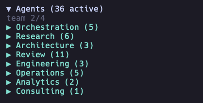
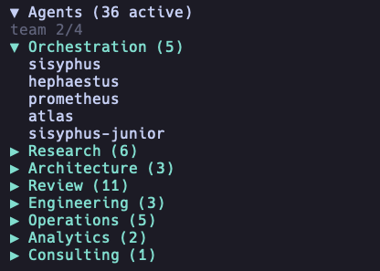
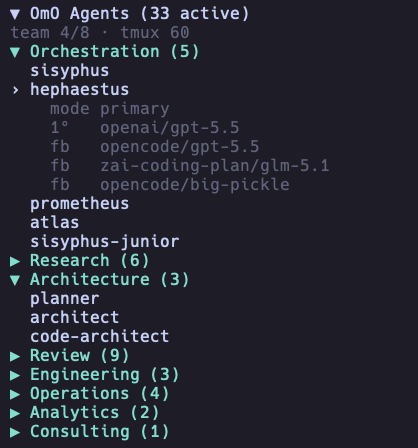

# opencode-agents-sidebar

> Universal OpenCode TUI sidebar plugin для просмотра agents и subagents. Metadata OhMyOpenAgent используется как optional bootstrap/enrichment source, а не как core product model.

[](https://www.npmjs.com/package/opencode-agents-sidebar)


[English version](README.md)

| Поле | Значение |
|---|---|
| Статус | Активно поддерживаемый персональный OpenCode tool/plugin |
| Тип | OpenCode TUI plugin / host extension |
| Host app | Документирован OpenCode `>= v1.14.49`; peer dependency `@opencode-ai/plugin >=1.4.0` |
| Package | `opencode-agents-sidebar` `1.0.8`, опубликован в npm |
| Runtime | Bun `>=1.1.0` |
| Проверки maintainer | `bun install && bun run build:all && bun test && bun run typecheck` |

## Скриншоты

Plugin отображает agent categories и details внутри sidebar терминального UI OpenCode.







## Сводка

- Показывает OpenCode agents в OpenCode sidebar.
- Использует normalized provider boundary, чтобы OpenCode-native, custom и optional OhMyOpenAgent sources могли питать один UI.
- Группирует agents в нейтральные категории: primary, subagents, built-in, project, global, custom, disabled, hidden и other.
- Поддерживает сворачиваемые category sections и сворачиваемый главный sidebar panel.
- Показывает provider, model, variant, fallback и disabled-agent информацию согласно display settings.
- Поддерживает compact и split row layouts для разных terminal widths.
- Поддерживает provider, model и variant aliases для более короткого terminal output.
- Перезагружает provider data через polling и fingerprint comparison.
- Обрабатывает отсутствующие или некорректные configuration files явными состояниями sidebar.

## Быстрый старт

```sh
# установить опубликованный OpenCode plugin глобально
opencode plugin opencode-agents-sidebar@latest --global --force

# опционально: собрать из локального checkout для разработки
git clone https://github.com/Mark1708/opencode-agents-sidebar.git
cd opencode-agents-sidebar
bun install
bun run build:all
```

Этот релиз является foundation для provider boundary: UI уже OpenCode-first, а native OpenCode agent discovery запланирован на следующий implementation phase.

## Установка

### Установка OpenCode plugin

```sh
opencode plugin opencode-agents-sidebar@latest --global --force
```

Это рекомендуемый путь для пользователей: plugin опубликован в npm, и OpenCode может установить его напрямую.

### Локальный checkout для разработки

```sh
git clone https://github.com/Mark1708/opencode-agents-sidebar.git
cd opencode-agents-sidebar
bun install
bun run build:all
```

Build создаёт plugin entry и TUI bundle в `dist/`.

Для локальной проверки в OpenCode установите checkout напрямую:

```sh
opencode plugin "file:/absolute/path/to/opencode-agents-sidebar" --global --force
```

## Совместимость

| Компонент | Поддерживаемая версия | Источник |
|---|---|---|
| Host app | OpenCode `>= v1.14.49` | README compatibility note |
| Plugin API | `@opencode-ai/plugin >=1.4.0` | `package.json` peer dependency |
| TUI runtime | `@opentui/solid >=0.1.0`, `solid-js >=1.8.0` | `package.json` peer dependencies |
| Local runtime | Bun `>=1.1.0` | `package.json` engines и Bun-based scripts |
| TypeScript | `^5.5.0` | `package.json` dev dependency |

## Конфигурация

Sidebar redesign построен вокруг normalized agent providers. В foundation release temporary bootstrap provider всё ещё читает:

```text
~/.config/opencode/oh-my-openagent.json
```

Этот файл больше не является core product model. Он используется только как optional/bootstrap source до реализации native OpenCode agent discovery.

Top-level sections вроде `agents`, `agent_order`, `disabled_agents`, `team_mode` и `tmux` — это общие данные OhMyOpenAgent. Sidebar отображает эти данные при наличии, но эти sections не являются отдельной configuration sidebar plugin.

Provider seam уже есть: `src/providers/omo.ts` адаптирует temporary bootstrap data, а `src/providers/custom.ts` является минимальной заготовкой для explicit custom agents.

Минимальная полезная конфигурация:

```json
{
  "tui": {
    "sidebar_width": 34,
    "name_width": 18,
    "title": "Agents"
  }
}
```

При использовании текущего OhMyOpenAgent bootstrap source оставьте legacy category order, если хотите привычную группировку:

```json
{
  "tui": {
    "title": "Agents",
    "category_order": ["Orchestration", "Research", "Architecture", "Review", "Engineering", "Operations", "Analytics", "Consulting", "Other"]
  }
}
```

Полная документированная форма:

```json
{
  "tui": {
    "sidebar_width": 34,
    "name_width": 18,
    "poll_interval_ms": 2000,
    "slot_order": 850,
    "title": "Agents",
    "category_order": ["Primary", "Subagents", "Built-in", "Project", "Global", "Custom", "Disabled", "Hidden", "Other"],
    "model_display": "details-only",
    "show_provider": true,
    "show_variant_in_details": false,
    "show_disabled": "dimmed",
    "agent_row_mode": "compact",
    "symbols": "unicode",
    "provider_aliases": {
      "openai": "oa",
      "opencode": "oc",
      "zai-coding-plan": "zai"
    },
    "model_aliases": {
      "gpt-5.4-mini-fast": "gpt-5.4mf",
      "gpt-5.4-mini": "gpt-5.4m",
      "gpt-5.5": "5.5",
      "glm-4.5-air": "glm-4.5a"
    },
    "variant_aliases": {
      "medium": "M",
      "high": "H",
      "xhigh": "XH"
    }
  }
}
```

Поддерживаемые значения:

- `model_display`: `"inline"`, `"details-only"` или `"hidden"`.
- `show_disabled`: `"hidden"`, `"dimmed"` или `"grouped"`.
- `agent_row_mode`: `"compact"` или `"split"`.
- `symbols`: `"unicode"` или `"ascii"`.

## Использование

- Запустите OpenCode с установленным plugin.
- Sidebar появится справа в TUI.
- Нажмите на main header, чтобы свернуть или раскрыть весь sidebar.
- Нажмите на category headers, чтобы свернуть или раскрыть provider groups.
- Нажмите на agent row, чтобы показать model, variant и fallback details.
- Настройте width, model display, aliases и symbol mode в provider metadata/config.

## Категории агентов

Default product categories — нейтральные OpenCode/provider categories из `src/defaults.ts`:

| Категория | Примеры |
|---|---|
| Primary | Main OpenCode agents после добавления native provider |
| Subagents | OpenCode subagents после добавления native provider |
| Built-in | Built-in host agents |
| Project | Project-local agents |
| Global | User-level agents |
| Custom | Custom provider agents |
| Disabled | Disabled agents при grouped display |
| Hidden | Reserved category для providers, которые раскрывают hidden entries |
| Other | Agents, которые не сопоставлены с известной category |

Temporary OhMyOpenAgent bootstrap provider хранит legacy lifecycle mapping внутри `src/providers/omo.ts`, чтобы этот mapping не становился generic product model.

## Параметры отображения

По умолчанию sidebar использует `agent_row_mode: "compact"` с `model_display: "details-only"`. Это оставляет agent list сфокусированным на names, а selected agent показывает model details ниже строки.

Runtime display включает main header, optional team status line, раскрытые или свёрнутые categories, details-only agent rows и selected agent details:

```text
▼ Agents (33 active)
team 2/4
▼ Custom (5)
› local-helper
    mode primary
    source custom
    1°   zai-coding-plan/glm-5.1
    fb   openai/gpt-5.5
    fb   opencode/big-pickle
  reviewer
  planner
▶ Other (3)
```

- `agent_row_mode`: `"compact"` оставляет каждого agent в одной строке. `"split"` использует две строки, когда `model_display` равен `"inline"`.
- `model_display`: `"details-only"` показывает provider и model details только для selected agent. `"inline"` показывает model information в agent row. `"hidden"` скрывает model information из rows и details.

## Структура проекта

```text
.
├── assets/                    # Local screenshots для README
├── dist/                      # Собранный package output
├── src/
│   ├── agents/                # Normalized agent types, grouping, merge logic
│   ├── providers/             # AgentProvider boundary и source implementations
│   ├── agents.ts              # Agent list/view-state helpers
│   ├── config.ts              # Raw JSON reading и sidebar config merge helpers
│   ├── defaults.ts            # Neutral sidebar defaults
│   ├── format.ts              # Text formatting и display utilities
│   ├── index.ts               # OpenCode plugin entry
│   ├── render.ts              # TUI plugin render entry
│   ├── tui.ts                 # Реализация TUI component
│   └── types.ts               # TypeScript type definitions
├── package.json               # Package metadata, scripts, peer dependencies
├── tsconfig.json              # TypeScript configuration
└── LICENSE
```

## Устранение неполадок

- Если published plugin не загружается, снова выполните `opencode plugin opencode-agents-sidebar@latest --global --force` и перезапустите OpenCode.
- Если local checkout не загружается, пересоберите его через `bun run build:all`, затем переустановите: `opencode plugin "file:/absolute/path/to/opencode-agents-sidebar" --global --force`.
- Если agents не отображаются в foundation release, проверьте, что temporary bootstrap provider имеет agent metadata.
- Если provider data некорректна, sidebar показывает neutral provider diagnostics.
- Если content обрезается, настройте `sidebar_width`, `name_width` или `agent_row_mode`.
- Если model names слишком длинные, используйте `model_aliases`, `provider_aliases` или `variant_aliases`.
- Если config changes не появляются сразу, дождитесь polling interval или перезапустите OpenCode.

## Ограничения / безопасность

- Foundation release читает local provider metadata, а не provider credentials. Текущий built-in data source — temporary OhMyOpenAgent bootstrap provider плюс минимальный custom-provider seam.
- Config reload использует provider file watchers с polling fallback и fingerprint comparison.
- Поведение sidebar width ограничено terminal и OpenCode TUI rendering.
- Styling зависит от возможностей host OpenCode и OpenTUI theme.
- Example configuration values являются placeholders и могут настраиваться под локальную среду.

## Статус

Активно поддерживаемый персональный OpenCode tool/plugin. Public issues и improvements приветствуются, но проект в первую очередь поддерживается под workflow автора.

## Ссылки / лицензия

- Package: <https://www.npmjs.com/package/opencode-agents-sidebar>
- Repository: <https://github.com/Mark1708/opencode-agents-sidebar>
- Host app: <https://opencode.ai/>
- Лицензия: MIT, см. [`LICENSE`](LICENSE)
